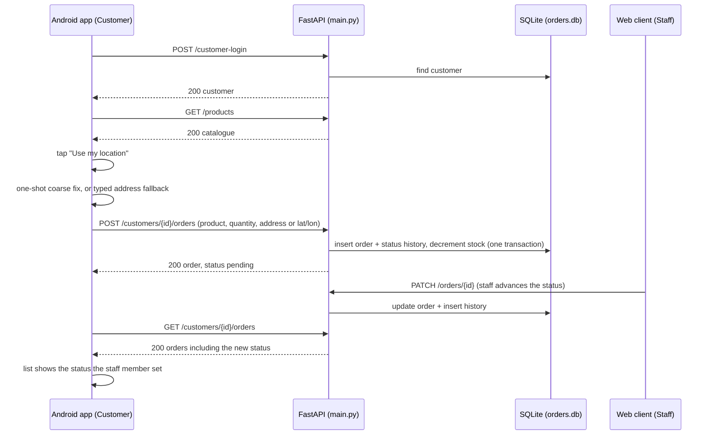

# Checkpoint 1 — Android to API workflow

**Date:** 2026-10-09 (end of week 1)
**Branch:** `android-client`, at commit `99cd4d87079f854361c3e5a0aa29f1cdc49b254c`
**State:** working tree clean, branch pushed to `origin/android-client`

This is the first of the two dated working checkpoints the brief requires. It records an
Android client completing a real shared workflow against the API.

## What works at this checkpoint

A native Android app with three screens, for the **Customer** role, talking to the Customer
Orders REST API. It is not a static interface: every screen makes real HTTP calls and reads
and writes real persistent data.



One user's action changes what the other can see and do: the customer places an order on
the phone, staff act on it through the web client, and the change is visible back on the phone.

### Screens

| # | Screen | API calls | Purpose |
|---|--------|-----------|---------|
| 1 | `MainActivity` | `POST /customer-login` | Customer signs in |
| 2 | `OrderListActivity` | `GET /products`, `GET /customers/{id}/orders` | See orders and their current status |
| 3 | `CreateOrderActivity` | `GET /products`, `POST /customers/{id}/orders` | Place an order with a delivery location |

## Mobile capability

The delivery location is captured from the device, with a typed address as the manual
fallback. This is the brief's "device location with a manual fallback" example, so the
mobile capability requirement is met by this checkpoint.

- only coarse **foreground** location is requested; no background location
- one-shot fix, never a continuous stream
- coordinates are **never invented**: if there is no usable fix the app says so
- a stale cached fix is detected and rejected rather than shown as current
- each failure mode has its own message, and every one points at the typed-address
  fallback, so a broken location never blocks an order

| Situation | Result |
|-----------|--------|
| Permission granted, fix arrives | lat/lon stored on the order |
| Permission denied | message, typed address used instead |
| Location services off | message, typed address used instead |
| No fix within 10s | message, typed address used instead |
| Only an old cached fix | rejected as stale, typed address used instead |
| No location hardware at all | app still runs (`uses-feature ... required="false"`) |

Both forms of destination reach the API and are stored on the order, so staff on the web
client can see where the delivery is going.

## Evidence

### Commits

All on `origin/android-client`, dated 2026-10-09. The baseline is `origin/Chang-FrontendViews`
at `478a6eb19c2dce79a0fa70cb050fb8160b2a6297`, which already contains Evan's data work at
`94aff519eb90a783c8b0cb105a366d150c27394d`. The branch therefore builds on both teammates'
completed work and needs no merge.

| Commit | Adds |
|--------|------|
| `0258b9e74e75be2d90bc9e35ebe5678b3e668119` | Android Studio project scaffold |
| `4b47e03ae6c81b7ff5ad26eca3003718f7737157` | HTTP client and JSON models |
| `c2d3c2f41f5370083cee48ab3f7b858ca199860e` | Device location capture with manual fallback |
| `c8eccfb632edb640c19687621dc1ee46e5f3af0b` | Three screens and layouts |
| `644458bcd41bd57ec66ad7e56222e3e764e4d55d` | Client README |
| `ac849ca5517b73b209c066f9b3d54ed6cc363f13` | Review fixes (double request on launch, unreachable success message, wrong suppression placement) |
| `99cd4d87079f854361c3e5a0aa29f1cdc49b254c` | Comment style pass to match the repo |

### Automated checks

**Build.** `gradlew clean assembleDebug` — 33 tasks, BUILD SUCCESSFUL, no warnings.

**API contract.** `scripts/check_api.py` against the live server with the seeded database:
**19 passed, 0 failed**. It covers exactly the fields the app parses and the rules it
depends on.

```
python seed.py
uvicorn main:app --reload      # in one terminal
python scripts/check_api.py    # in another
```

| # | Check | Result |
|---|-------|--------|
| 1 | `POST /customer-login` valid → 200 with id, name, email | pass |
| 2 | `POST /customer-login` unknown → 401 | pass |
| 3 | `GET /products` → 200 | pass |
| 4 | product fields id, name, price, stock present | pass |
| 5 | order with device location created | pass |
| 6 | latitude and longitude stored as sent | pass |
| 7 | new order status is `pending` | pass |
| 8 | order with typed address created | pass |
| 9 | address stored as sent | pass |
| 10 | no location stored when an address is used | pass |
| 11 | order with neither → 422 | pass |
| 12 | stock exceeded → 400 | pass |
| 13 | quantity 0 rejected | pass |
| 14 | unknown customer on create → 404 | pass |
| 15 | `GET /customers/{id}/orders` → 200 | pass |
| 16 | both new orders returned | pass |
| 17 | all 8 order fields the app reads are present | pass |
| 18 | orders for unknown customer → 404 | pass |
| 19 | error body `detail` parseable as string or array | pass |

### Manual demonstration

Completed by hand on an emulator with the seeded data (`Evan` / `evan@test.com`):

1. sign in on the phone
2. place an order using "Use my location"
3. advance its status from the staff web client
4. refresh on the phone and see the status change

The manual fallback was also demonstrated by declining the location permission and
completing an order with a typed address.

> Still to capture for the final submission: screenshots or video of steps 1 to 4 and of
> the permission-denied fallback, and a measured response time (see below).

## Finding from the checks — create returns 200, not 201

`POST /customers` and `POST /customers/{id}/orders` both return **200 OK** with no
`Location` header. Week 6 teaches that a create should return **201 Created** with a
`Location` header, and the Assessment 2 baseline did exactly that. The checks above assert
the current behaviour (200) so they record the truth rather than a wish.

This is a small, self-contained improvement for whoever owns the API: add
`status_code=201` and a `Location` header to the two create endpoints, then flip
`scripts/check_api.py` to expect 201. It should be done before the API is frozen.

## Not yet done at this checkpoint

Recorded so the gaps are explicit rather than hidden:

- **No non-functional measurement yet.** The brief needs at least one measured response
  time with a justified target, test conditions and observed result. Not started.
- **Only the Customer role is on the phone.** Staff actions stay on the web client, which is
  correct for this role, but the app cannot complete the whole workflow alone.
- **No live updates.** Orders are re-read on resume, not pushed. That is the later
  WebSocket checkpoint.
- **Two deliberate deviations** from the Week 9 lecture, both documented in
  `android-client/README.md`: the platform `LocationManager` API is used instead of the
  deprecated-in-favour-of Fused Location Provider, and `onSaveInstanceState` is used instead
  of Jetpack `ViewModel`. Both avoid the first external dependency. These are good material
  for the individual report's critical reflection.

## Contribution record

- **Individual work.** Everything on `android-client`, plus `scripts/check_api.py` and this
  document, was written by the Android client assignee. No code from the Assessment 2
  baseline or from the `evan-database` and `Chang-FrontendViews` branches was modified or
  rewritten. The diff against `478a6eb` is 31 new files and no changes to existing files,
  which keeps reused versus new work easy to separate in the report.
- **Shared work.** No pair work at this checkpoint. The branch was cut from
  `Chang-FrontendViews` rather than `main` so it could build on both teammates' completed
  work; that is an integration decision, not shared authorship.
- **Depends on.** Evan's `delivery_address`, `latitude` and `longitude` columns and the
  `product_id` order link; Chang's `/customer-login`, `/products` and
  `/customers/{id}/orders` endpoints and the static web client. None were changed here.
